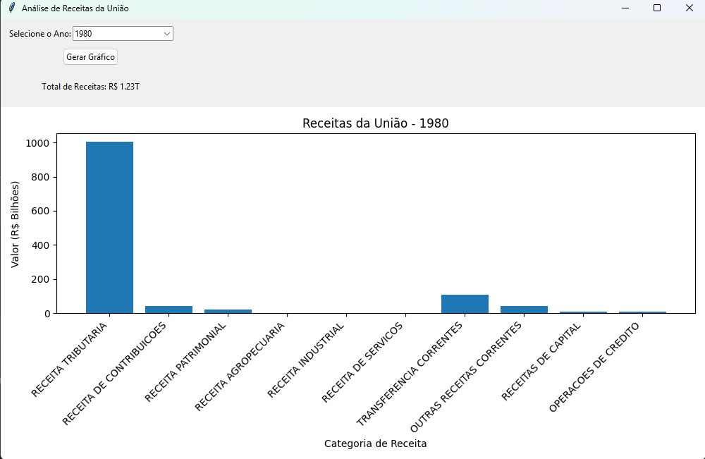

# Análise Interativa das Receitas Orçamentárias da União (1980-2017)

## Descrição
Este projeto analisa as receitas da União usando dados do Portal Brasileiro de Dados Abertos. Uma interface gráfica em Tkinter permite explorar receitas por ano e tipo (ex.: Tributária, Contribuições), com gráficos interativos e totais formatados (ex.: R$ 1,23T).

## Fonte dos Dados
- **Dataset**: Receita Orçamentária da União
- **Fonte**: [dados.gov.br](https://dados.gov.br/dados/conjuntos-dados/receita-orcamentaria-da-uniao)
- **Licença**: ODbL (Open Data Commons Open Database License)

## Estrutura do Projeto
- `analise_receitas.py`: Script com análise e interface Tkinter.
- `Receita-Orcamentaria-da-Uniao.csv`: Dataset com 19 colunas (12 usadas).
- `requirements.txt`: Dependências do projeto.

## Como Executar
1. Instale as dependências: `pip install -r requirements.txt`
2. Execute: `python analise_receitas.py`

## Resultados
- Interface exibe totais formatados (ex.: R$ 1,22T em 1980).
- Exemplo: A Receita Tributária representou 82% das receitas correntes em 2017.

## Ferramentas
- Python (pandas, matplotlib, tkinter)

## Screenshots
